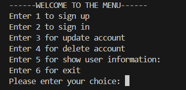

# Account Management System

This project is an **Account Management System** developed using the Python programming language and an SQLite database, enabling users to manage their accounts. 

In this **Account Management System**, users can perform the following actions:
- Sign up (create a new account)
- Sign in (log into their account)
- Update account information (email or password or both of them)
- Delete their account
- Show user information (showing email and password information)

## Installation

1) ### Clone the repository

```bash 
git clone https://github.com/Ege-Szr/Account-Management-System
```

2) ### Go to the project directory

```bash
cd Account-Management-System
```

3) ### Run the project

```bash
python main.py
```

## Technologies Used

--->**Python 3.14.0**

--->**SQlite3**

--->**Regular Expression Module(re)**

--->**time Module**

## Project Structure

```
Account-Management-System/
|
├──main.py                  -> Main application logic and user input handling
├──database.py              -> All database operations 
├──Accounts_Information.db  -> Stores users email and password information
├──image/
|    └──Menu.png                       
└── README.md               -> Documentation of Account Management System
```

## Project Features

- User sign up with input validation
- User login system
- Update user account information
- User account deletion functionality
- Email and password validation using Regular Expressions (re)
- Data storage using SQLite database
- Error handling using try-except blocks

## How to use 

### Run

```bash
python main.py
```

### Main Menu

-> After the running the program,a "Welcome to the menu" message and available options will be displayed.




